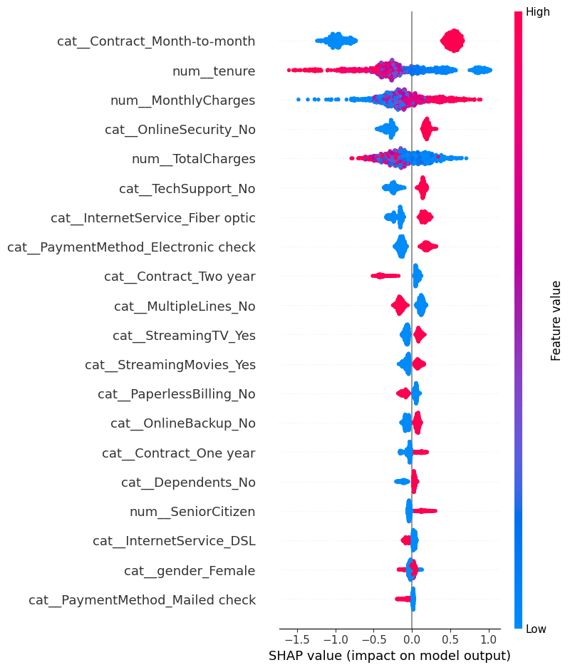

# Customer Churn Prediction AI


## Live Demo 🚀

Streamlit Application:

https://customer-churn-ai-mqwtfcvugrnpmus53nz7ta.streamlit.app/


---

# Project Overview

An end-to-end machine learning application that predicts customer churn risk using **XGBoost** and provides actionable customer retention insights through an interactive **Streamlit dashboard**.

The project covers the complete machine learning workflow:

- Exploratory Data Analysis
- Data preprocessing
- Model training and evaluation
- XGBoost classification
- Feature importance interpretation
- Streamlit deployment
- Customer retention recommendations
- PDF churn analysis report generation


---

# Business Problem

Customer churn is a major challenge for subscription-based businesses.

Losing customers directly impacts revenue and growth.

This project helps organizations:

- Identify customers likely to leave
- Understand important churn factors
- Prioritize retention strategies
- Take proactive customer actions


---

# Machine Learning Workflow


## Data Analysis

Performed:

- Dataset exploration
- Feature analysis
- Churn pattern investigation
- Customer behavior analysis


## Data Processing

Implemented:

- Missing value handling
- Numerical feature scaling
- Categorical feature encoding
- Scikit-learn preprocessing pipeline


## Model Training

Multiple machine learning models were evaluated:


| Model | ROC-AUC |
|---|---|
| Logistic Regression | 0.836 |
| Random Forest | 0.814 |
| XGBoost | 0.836 |


## Final Production Model

**XGBoost Classifier**

Evaluation Metric:

ROC-AUC

Performance:

0.836

Production model format:

xgb_churn_model.json


---

# Model Interpretability

Feature importance analysis was applied to understand which customer attributes influence churn predictions.


## Key Churn Drivers

The model identified these important churn factors:


1. Month-to-month contracts

2. Customer tenure

3. Monthly charges

4. Lack of online security

5. Lack of technical support

6. Fiber optic internet service

7. Electronic check payment method


These insights help businesses create targeted retention strategies.


---


# Streamlit Dashboard


The application provides:


## Customer Risk Prediction

- Churn probability prediction
- Low / Medium / High risk classification
- Interactive customer prediction interface


## Feature Impact Visualization

- Model-based feature importance ranking
- Identification of major churn factors


## Customer Retention Recommendations

The system generates actionable recommendations:

- Offer long-term contract discounts
- Review pricing strategy
- Improve support engagement
- Recommend additional security services


## PDF Churn Report

Users can download a customer analysis report containing:

- Prediction result
- Churn probability
- Risk category
- Important churn drivers
- Recommended retention actions


---


# Application Screenshot





---


# Project Architecture


```
Customer Data
      |
      v
Exploratory Data Analysis
      |
      v
Data Cleaning & Preprocessing
      |
      v
Feature Engineering
      |
      v
Machine Learning Models

(Logistic Regression
 Random Forest
 XGBoost)

      |
      v

Model Evaluation

(ROC-AUC Comparison)

      |
      v

XGBoost Production Model

      |
      v

Streamlit Application

      |
      v

Customer Input
      |
      v

Churn Probability Prediction
      |
      v

Risk Classification

(Low / Medium / High)

      |
      v

Feature Importance Analysis
      |
      v

Retention Recommendations
      |
      v

PDF Churn Report
```

---

# Technology Stack


## Programming Language

- Python


## Data Science & Machine Learning

- Pandas
- NumPy
- Scikit-learn
- XGBoost


## Visualization

- Plotly


## Deployment

- Streamlit


## Reporting

- ReportLab
```

---

---

# Project Structure


```
customer-churn-ai/

├── app/
│   └── app.py

├── data/
│   └── WA_Fn-UseC_-Telco-Customer-Churn.csv

├── models/
│   ├── feature_names.pkl
│   ├── preprocessor.pkl
│   ├── xgb_churn_model.json
│   └── xgb_churn_model.pkl

├── notebooks/
│   └── 01_eda.ipynb

├── src/

├── image.png

├── requirements.txt

├── runtime.txt

├── README.md

├── LICENSE

└── .gitignore
```

---

# Installation


## Clone Repository

```bash
git clone https://github.com/diptadaswork21-code/customer-churn-ai.git
```


## Navigate to Project

```bash
cd customer-churn-ai
```


## Install Dependencies

```bash
pip install -r requirements.txt
```


## Run Application

```bash
streamlit run app/app.py
```

---

# Future Improvements


- Add automated model retraining pipeline
- Add model monitoring system
- Integrate real-time customer database
- Add Docker deployment
- Add advanced explainability methods
- Build API endpoint for predictions
```

---

# License

This project is licensed under the MIT License.
```


